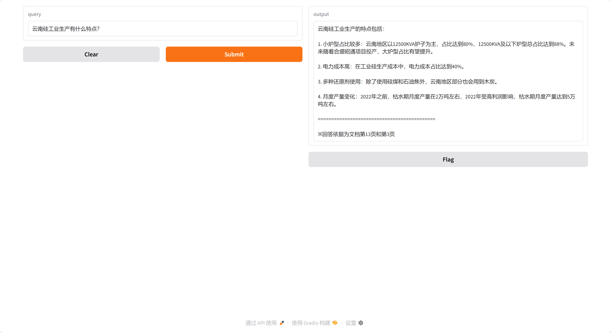

# Chat-RemoteSensing 
快速获取卫星遥感信息的RAG知识库

## ✨特性
-核心功能点1：根据用户提问，在上传的PDF文件检索需要的遥感信息，并由大模型生成易于理解的回答。
-核心功能点2：同时返回回答的参考依据，增加回答可信度。

## 🔧环境要求与配置
### 1. Milvus数据库
- **windows-docker部署**：参考 [Milvus 安装文档](https://milvus.io/docs/zh/install_standalone-windows.md) 启动服务。

### 2. API Key
本项目需要调用OpenAI服务。请自行申请API Key。

### 3. 配置方式
**配置文件**：在 `config.yaml` 文件中配置 Milvus 连接参数`host` 和 `port` 
**环境变量**：系统设置 → 高级系统设置 → 环境变量 → 新建→[{变量名: OPENAI_API_KEY}, {变量值: sk-xxx（你的API Key）}]

## 🚀快速开始
-Python脚本： `python app.py`→点击http://127.0.0.1:7860

## 📝使用实例

